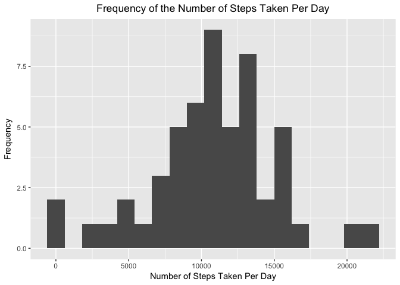

# Reproducible Research: Peer Assessment 1
### Brad Jahnke, July 2017
This repository was forked from http://github.com/rdpeng/RepData_PeerAssessment1

## Loading and preprocessing the data
Let's first load libraries we'll use.

```r
library(downloader)
library(data.table)
library(plyr)
library(dplyr)
library(lubridate)
library(ggplot2)
library(xtable)
library(mice)
library(zoo)
```

Then we'll set the working directory and load the activty.csv included in the repo with read.csv

```r
setwd("~/Coursera/Course5_ReproducibleResearch/week2/r_working/RepData_PeerAssessment1")

if (!file.exists("data")) {
  dir.create("data")
}

unzip("./activity.zip", exdir="./data")
activity <- read.csv("./data/activity.csv")
activityDT <- data.table(activity)
```

Then we'll make a date time field with lubridate.  Before that we'll use some regular expressions to parse the interval variable into a character version of our datetime.


```r
activityDT$hmtime <- sub("^(.)$", "00:0\\1", activityDT$interval)
activityDT$hmtime <- sub("^(..)$", "00:\\1", activityDT$hmtime)
activityDT$hmtime <- sub("^(.)(..)$", "0\\1:\\2", activityDT$hmtime)
activityDT$date.time <- paste(activityDT$date,activityDT$hmtime)
activityDT$date.time <- ymd_hm(activityDT$date.time)
activityDT$date <- ymd(activityDT$date)
```

THe mice package does not handle character variables so we'll convert the hmtime variable into a factor

```r
activityDT$hmtime <- as.factor(activityDT$hmtime)
```

Then we'll create a variable with the name of the day

```r
activityDT$wdayname <- wday(activityDT$date,label=TRUE)
```

Then we'll create a factor variable identifying weekend or weekday

```r
activityDT$wdaylevel <- ifelse(activityDT$wdayname == "Sat"|activityDT$wdayname == "Sun","weekend","weekday")
activityDT$wdaylevel <- as.factor(activityDT$wdaylevel)
```

Here's what the first several rows of our activityDT look like

```r
head(activityDT)
```

```
##    steps       date interval hmtime           date.time wdayname wdaylevel
## 1:    NA 2012-10-01        0  00:00 2012-10-01 00:00:00      Mon   weekday
## 2:    NA 2012-10-01        5  00:05 2012-10-01 00:05:00      Mon   weekday
## 3:    NA 2012-10-01       10  00:10 2012-10-01 00:10:00      Mon   weekday
## 4:    NA 2012-10-01       15  00:15 2012-10-01 00:15:00      Mon   weekday
## 5:    NA 2012-10-01       20  00:20 2012-10-01 00:20:00      Mon   weekday
## 6:    NA 2012-10-01       25  00:25 2012-10-01 00:25:00      Mon   weekday
```


## What is mean total number of steps taken per day?
First let's create our data frame aggregating the sum of steps per day.

```r
stepsPerDay <- aggregate(steps ~ date,activityDT %>% select(date,steps),sum)
stepsPerDayRNA <- aggregate(steps ~ date,activityDT %>% select(date,steps),sum, na.rm=TRUE)
```

Here's what the first several rows of the stepsPerDay data frame look like

```r
head(stepsPerDay)
```

```
##         date steps
## 1 2012-10-02   126
## 2 2012-10-03 11352
## 3 2012-10-04 12116
## 4 2012-10-05 13294
## 5 2012-10-06 15420
## 6 2012-10-07 11015
```

With ggplot2 we'll make a histogram of the total number of steps per day.  You can see data is missing for some days.  Days of the week are displayed in different colors.

```r
g1 <- ggplot(stepsPerDay,aes(date,steps))

g1 + geom_col(aes(fill=wday(stepsPerDay$date,label=TRUE))) + 	labs(x="Date",y="Steps",color="Week Day") + ggtitle("Steps Per Day") + theme(plot.title = element_text(hjust = 0.5)) + theme(axis.text.x=element_text(angle=90)) + scale_x_date(date_breaks= "1 day",expand=c(0,0)) + theme(legend.title=element_blank())
```

<!-- -->

We can see the mean and median steps from a simple summary.


```r
summary(stepsPerDay$steps)
```

```
##    Min. 1st Qu.  Median    Mean 3rd Qu.    Max. 
##      41    8841   10765   10766   13294   21194
```

We can also keep the mean and median steps from stepsPedDay in variables so we can easily refer to them in this document.

```r
 q1mean <- sprintf("%.*f",0,mean(stepsPerDay$steps))
 q1median <- sprintf("%.*f",0,median(stepsPerDay$steps))
```

Withough removing the missing data, the **mean steps per day is 10766**  and the **median steps per day is 10765**.

## What is the average daily activity pattern?
Using ggplot2, let's create a time series plot of the 5-minute interval on the x-axis and the average number of steps taken, averaged across all day on the y-axis.

First let's create the aggregate data frame from which we'll create the plot

```r
stepsPerPeriodAvg <- aggregate(steps ~ interval,activityDT %>% select(interval,steps),mean, na.rm=TRUE)
```

Let's also determine which interval has the highest average of steps

```r
maxAvgStepsPer5 <- max(stepsPerPeriodAvg$steps)

IntForMaxAvgStepsPer5 <- stepsPerPeriodAvg[which(stepsPerPeriodAvg$steps==max(stepsPerPeriodAvg$steps)),]$interval

stepsPerPeriodAvg[which(stepsPerPeriodAvg$steps==max(stepsPerPeriodAvg$steps)),]$interval
```

```
## [1] 835
```

Finally let's put the plot together, highlighting the interval with the highest average number of steps

```r
g2 <- ggplot(stepsPerPeriodAvg,aes(interval,steps))

g2 + geom_line() + 	labs(x="5-Minute Interval",y="Average Steps") + ggtitle("Average Steps Per 5-Minute Interval") + theme(plot.title = element_text(hjust = 0.5)) + geom_text(x=IntForMaxAvgStepsPer5,y=maxAvgStepsPer5,label=paste("Interval=",IntForMaxAvgStepsPer5," ","Avg Steps=",round(maxAvgStepsPer5,1)),color="blue",hjust="left")
```

<!-- -->

Now, it is clear that interval 835 has the highest average number of steps (206.2).

## Imputing missing values
As mentiond earlier we saw some days that had no steps recorded. Let's see if the missing data has any impact in our calculations and data summary.

First we can you the mice package to quickly see the total number of missing values.

```r
md.pattern(activityDT)
```

```
##       date interval hmtime date.time wdayname wdaylevel steps     
## 15264    1        1      1         1        1         1     1    0
##  2304    1        1      1         1        1         1     0    1
##          0        0      0         0        0         0  2304 2304
```

We see there are 2304 missing rows.

We can also see the percent missing data.

```r
mean(is.na(activityDT$steps))
```

```
## [1] 0.1311475
```

So that's about 13 percent...

Now, let's use the zoo package to fill in the missing values into a new dataset.  Let's fill in the the number of steps for a given period from the mean calculated for that period across all days of the same name (i.e., if the missing data is from interval 200 on a Monday, fill in the the number of steps from the mean taken from all the period 200 taken across all Mondays)

```r
activity4impDT <- activityDT
activity4impDT$steps <- na.aggregate(activityDT$steps,by=activityDT$wdayname,activityDT$interval)
md.pattern(activity4impDT)
```

```
##      steps date interval hmtime date.time wdayname wdaylevel  
## [1,]     1    1        1      1         1        1         1 0
## [2,]     0    0        0      0         0        0         0 0
```

Now let's make a histogram like we had done earlier where we had seen the missing days, but this time with our new dataset with the missing values filled in.

First we create our aggregate data frame.

```r
stepsPerDay4imp <- aggregate(steps ~ date,activity4impDT %>% select(date,steps),sum)
```

Then we create our histogram using ggplot2.

```r
g3 <- ggplot(stepsPerDay4imp,aes(date,steps))

g3 + geom_col(aes(fill=wday(stepsPerDay4imp$date,label=TRUE))) + 	labs(x="Date",y="Steps",color="Week Day") + ggtitle("Steps Per Day Imputed Dataset") + theme(plot.title = element_text(hjust = 0.5)) + theme(axis.text.x=element_text(angle=90)) + scale_x_date(date_breaks= "1 day",expand=c(0,0)) + theme(legend.title=element_blank())
```

<!-- -->

Let's calculate the mean and median total number of steps per day for our new dataset as well

```r
summary(stepsPerDay4imp$steps)
```

```
##    Min. 1st Qu.  Median    Mean 3rd Qu.    Max. 
##      41    8918   11015   10821   12811   21194
```

We can also keep the mean and median steps from stepsPedDay in variables so we can easily refer to them in this document.

```r
 q3mean <- sprintf("%.*f",0,mean(stepsPerDay4imp$steps))
 q3median <- sprintf("%.*f",0,median(stepsPerDay4imp$steps))
```

Now with filling in the missing data, we have the **mean steps per day is 10821**  and the **median steps per day is 11015**.

There median is slightly higher, but the means are not very different at all.

If we plot the original data set as points, then draw a line of the imputed dataset, we can see there is not that much of a difference.

```r
(g3b <- ggplot(NULL,aes(date,steps)) + geom_point(data=stepsPerDay,color="blue") + geom_line(data=stepsPerDay4imp))
```

<!-- -->


## Are there differences in activity patterns between weekdays and weekends?


```r
stepsPerPeriodAvgDayType <- aggregate(steps ~ interval+wdayname+wdaylevel,activityDT %>% select(wdaylevel,wdayname,interval,steps),mean, na.rm=TRUE)
```


```r
g4 <- ggplot(stepsPerPeriodAvgDayType,aes(interval,steps))

g4 + geom_line() + 	labs(x="5-Minute Interval",y="Average Steps") + ggtitle("Average Steps Per 5-Minute Interval") + theme(plot.title = element_text(hjust = 0.5)) +  facet_grid(wdaylevel~.)
```

<!-- -->

We can see that there are generally less steps on the weekend, and it looks like individuals sleep a bit later.
